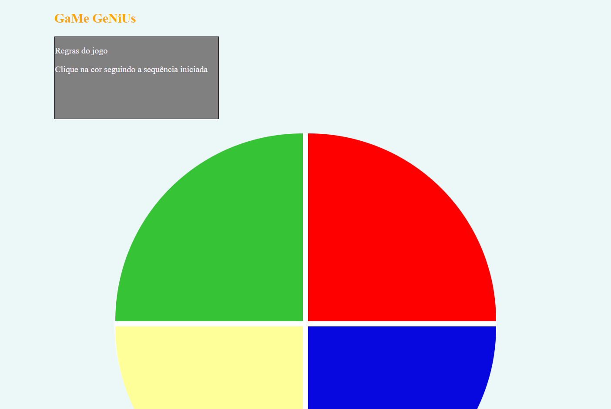

# Projeto Jogo Genius

> Plataforma Digital Innovation One

 Nesse projeto foi criado um jogo semelhante ao Genius utilizando apenas HTML5, CSS3 e Javascript.
 Desenvolvido em aula 10/12/21.

[ 📎 Clique aqui para acessar] (https://michel-maia.github.io/Projeto-jogo-da-memoria-estilo-Genius/)

 ## Tecnologias 🖥️ 🚀 

- HTML
- CSS
- JavaScript
- Git e GitHub
